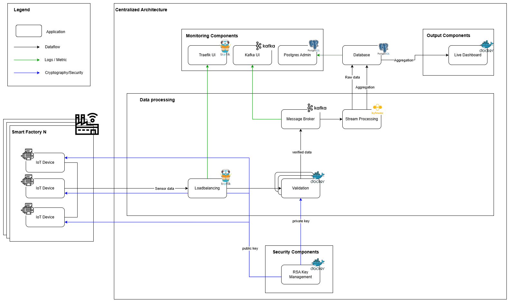

<!-- Improved compatibility of back to top link: See: https://github.com/othneildrew/Best-README-Template/pull/73 -->
<a id="readme-top"></a>

<!-- TABLE OF CONTENTS -->
<details>
  <summary>Table of Contents</summary>
  <ol>
    <li>
      <a href="#about-the-project">About The Project</a>
      <ul>
        <li><a href="#built-with">Built With</a></li>
        <li><a href="#Features">Features</a></li>
        <li><a href="#Architecture">Architecture</a></li>
      </ul>
    </li>
    <li>
      <a href="#getting-started">Getting Started</a>
      <ul>
        <li><a href="#prerequisites">Prerequisites</a></li>
        <li><a href="#installation">Installation</a></li>
      </ul>
    </li>
    <li><a href="#license">License</a></li>
    <li><a href="#contact">Contact</a></li>
  </ol>
</details>


<!-- ABOUT THE PROJECT -->
## About The Project

This microservice-based streaming architecture processes signed sensor data from multiple factories in real time. The data is transferred via FastAPI, verified by an RSA-based verification service, and forwarded via Kafka. Bytewax handles time-based aggregation and storage in PostgreSQL. A dashboard visualizes the aggregated values, while Traefik, as a dynamic load balancer, controls routing.


<p align="right">(<a href="#readme-top">back to top</a>)</p>


### Built With

- **FastAPI** – for API endpoints and service communication
- **Apache Kafka** – distributed streaming platform
- **Bytewax** – Python-native stream processing engine
- **PostgreSQL** – reliable relational database for persistence
- **Traefik** – dynamic reverse proxy for service discovery and load balancing
- **Docker & Docker Compose** – for containerization and orchestration
- **RSA (Cryptography)** – to ensure data integrity and authenticity

<p align="right">(<a href="#readme-top">back to top</a>)</p>


<!-- Features Overview -->
### Features

- Real-time streaming and validation of sensor data
- RSA signature verification for data integrity
- Kafka-based decoupled data ingestion
- Tumbling window aggregation (10-second intervals)
- Persistent storage of raw + aggregated data
- Reproducible with one command using Docker

<p align="right">(<a href="#readme-top">back to top</a>)</p>

<!-- Architecture Overview -->
### Architecture

<div align="center">
  
</div>

<p align="right">(<a href="#readme-top">back to top</a>)</p>


<!-- GETTING STARTED -->
## Getting Started

To get a local copy up and running follow these simple example steps.

### Prerequisites

Docker Desktop & Docker Compose installed locally.

### Installation

Below is an example of how you can instruct your audience on installing and setting up your app.

1. Clone the repo
   ```sh
   git clone https://github.com/DrLeXXan/iu-project-data-engineering.git
   ```
2. Start all services
   ```sh
   docker-compose up --build
   ```

Services should now be available under:

**API**
- http://localhost:8001/stream – Live stream via Traefik
- http://localhost:8000/private-key – Private Key from Cryptography-Service
- http://localhost:8000/public-key – Public Key from Cryptography-Service

**UI**
- http://localhost:8080 – Traefik dashboard
- http://localhost:8081 – Kafka dashboard
- http://localhost:5050 – Postgres Admin dashboard (Username: factory_user, Password: mypassword)
- http://localhost:8003 – Factory dashboard

<p align="right">(<a href="#readme-top">back to top</a>)</p>


<!-- LICENSE -->
## License

Distributed under the MIT License. See `LICENSE.txt` for more information.

<p align="right">(<a href="#readme-top">back to top</a>)</p>


<!-- CONTACT -->
## Contact

LinkedIn - [@lennartboehm](https://www.linkedin.com/in/lennartboehm)

Project Link: [https://github.com/DrLeXXan/iu-project-data-engineering](https://github.com/DrLeXXan/iu-project-data-engineering)

<p align="right">(<a href="#readme-top">back to top</a>)</p>
